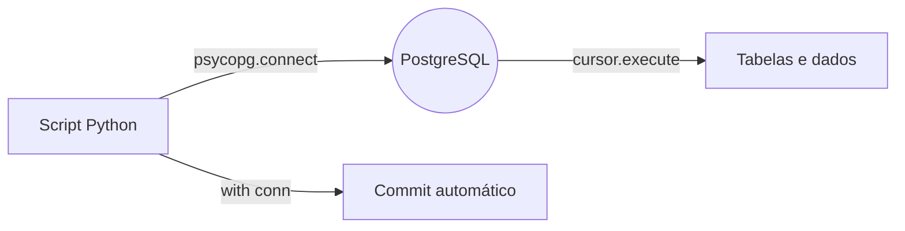

# Integração Python + PostgreSQL 🐘🐍

Projeto de exemplo que mostra, passo a passo, como **conectar um script Python a um banco de dados PostgreSQL**.

A conexão é feita com a biblioteca [**psycopg 3**](https://www.psycopg.org/psycopg3/), a versão moderna do driver PostgreSQL para Python, e o gerenciamento de dependências e ambiente virtual fica por conta do [**uv**](https://docs.astral.sh/uv/).

---

## 📑 Índice

- [Como funciona a integração](#-como-funciona-a-integração)
- [Pré-requisitos](#-pré-requisitos)
- [Instalação do projeto](#-instalação-do-projeto)
- [Passo 1 — Criar o banco de dados no pgAdmin](#-passo-1--criar-o-banco-de-dados-no-pgadmin)
- [Passo 2 — Montar a string de conexão](#-passo-2--montar-a-string-de-conexão)
- [Passo 3 — Conectar pelo Python](#-passo-3--conectar-pelo-python)
- [Passo 4 — Inserir dados com variáveis (INSERT)](#-passo-4--inserir-dados-com-variáveis-insert)
- [Passo 5 — Executar o script](#-passo-5--executar-o-script)
- [Passo 6 — Conferir o resultado no pgAdmin](#-passo-6--conferir-o-resultado-no-pgadmin)
- [Exemplo completo (CRUD básico)](#-exemplo-completo-crud-básico)
- [Boas práticas de segurança](#-boas-práticas-de-segurança)
- [Solução de problemas](#-solução-de-problemas)
- [Referências](#-referências)

---

## 🔎 Como funciona a integração



O fluxo é sempre o mesmo:

1. O Python abre uma **conexão** com o servidor PostgreSQL (host + porta + usuário + senha + nome do banco).
2. A partir da conexão, criamos um **cursor**, que é o objeto responsável por enviar os comandos SQL.
3. Executamos os comandos (`CREATE TABLE`, `INSERT`, `SELECT`, ...). Quando um comando precisa de valores dinâmicos, eles são enviados como **parâmetros** (`%s`) junto com o SQL — nunca concatenados na string.
4. Ao sair do bloco `with conn:`, o psycopg faz o **commit** automaticamente — ou o **rollback**, caso ocorra um erro.

---

## 🧰 Pré-requisitos

| Ferramenta | Versão sugerida | Para que serve |
| --- | --- | --- |
| [Python](https://www.python.org/downloads/) | 3.14 ou superior | Executar o script |
| [uv](https://docs.astral.sh/uv/getting-started/installation/) | qualquer versão recente | Criar o ambiente virtual e instalar as dependências |
| [PostgreSQL](https://www.postgresql.org/download/) | 18 (ou compatível) | Servidor de banco de dados |
| [pgAdmin](https://www.pgadmin.org/download/) | 4 ou superior | Interface gráfica para administrar o banco |

> 💡 O `uv` é opcional: você também pode usar `python -m venv .venv` + `pip install "psycopg[binary]"`.

---

## 📦 Instalação do projeto

Clone o repositório e instale as dependências:

```bash
git clone <url-do-repositorio>
cd post-py-integration

# cria o ambiente virtual (.venv) e instala o que está no pyproject.toml
uv sync
```

A dependência declarada no `pyproject.toml` é:

```toml
dependencies = [
    "psycopg[binary]>=3.3.6",
]
```

O extra `[binary]` já traz os binários do `libpq` embutidos, então **não é necessário instalar o PostgreSQL Client** na máquina.

---

## 🗄️ Passo 1 — Criar o banco de dados no pgAdmin

Abra o **pgAdmin**, conecte-se ao seu servidor PostgreSQL e crie um banco chamado `integrado-python`:

1. Clique com o botão direito em **Databases** → **Create** → **Database...**
2. Informe o nome `integrado-python` e confirme.
3. O banco deve aparecer na árvore do servidor, exatamente como na imagem abaixo:


> Se preferir fazer isso por linha de comando:
>
> ```bash
> createdb -U postgres integrado-python
> ```

---

## 🔌 Passo 2 — Montar a string de conexão

O psycopg aceita uma *connection string* no formato `chave=valor`, separada por espaços:

```python
"dbname=integrado-python user=postgres password=postgres"
```

| Parâmetro | Descrição | Padrão |
| --- | --- | --- |
| `dbname` | Nome do banco de dados | mesmo valor de `user` |
| `user` | Usuário do PostgreSQL | usuário do sistema operacional |
| `password` | Senha do usuário | — (obrigatória) |
| `host` | Endereço do servidor | `localhost` via socket Unix |
| `port` | Porta do servidor | `5432` |

Se o banco estiver em outro host ou em outra porta, informe explicitamente:

```python
"host=localhost port=5432 dbname=integrado-python user=postgres password=postgres"
```

> ⚠️ Nunca coloque a senha direto no código em projetos reais. Veja [Boas práticas de segurança](#-boas-práticas-de-segurança).

---

## 🐍 Passo 3 — Conectar pelo Python

O arquivo `main.py` deste projeto faz a conexão, cria uma tabela e insere um registro:

```python
import psycopg

# dbname vai receber o nome do banco de dados,
# user vai receber o nome do usuário e
# password vai receber a senha do usuário
with psycopg.connect("dbname=integrado-python user=postgres password=postgres") as conn:
    with conn.cursor() as cur:
        # Cria a tabela no banco
        cur.execute("""
            CREATE TABLE teste2 (
                id serial PRIMARY KEY,
                num INT,
                data VARCHAR(14)
            )
        """)

        # Insere um registro usando variáveis (parâmetros)
        cur.execute("""
            INSERT INTO teste2 (num, data) VALUES (%s, %s)
            """, (1, "Um texto aqui!"))

def main():
    print("Hello from post-py-integration!")


if __name__ == "__main__":
    main()
```

Entendendo linha por linha:

- `import psycopg` — importa o driver do PostgreSQL.
- `psycopg.connect(...)` — abre a conexão. Se os dados estiverem errados, uma exceção (`psycopg.OperationalError`) é lançada imediatamente.
- `with ... as conn:` — o *context manager* da conexão. Ao sair do bloco com sucesso, o **commit** é executado; se houver exceção, é feito **rollback**.
- `with conn.cursor() as cur:` — abre o cursor e garante que ele seja fechado ao final.
- `cur.execute(""" CREATE TABLE teste2 ... """)` — envia o `CREATE TABLE`, que cria a tabela `teste2` com três colunas:
  - `id` — chave primária, incrementada automaticamente (`serial`);
  - `num` — número inteiro (`INT`);
  - `data` — texto de **até 14 caracteres** (`VARCHAR(14)`).
- `cur.execute(""" INSERT ... """, (1, "Um texto aqui!"))` — envia o `INSERT` passando os valores como **parâmetros**. Esse ponto é detalhado no [Passo 4](#-passo-4--inserir-dados-com-variáveis-insert).
- `def main():` — função apenas "institucional" do template do `uv`; imprime uma saudação e **não** participa da conexão com o banco.

> 💡 O bloco de conexão está no nível do módulo (fora de `main()`), ou seja, ele roda **assim que o arquivo é importado ou executado**. Em projetos reais, o ideal é colocar esse código dentro de uma função para você controlar quando a conexão acontece.

---

## 🔤 Passo 4 — Inserir dados com variáveis (INSERT)

No `main.py`, o segundo `execute` insere uma linha na tabela passando os valores como **variáveis** em vez de escrevê-los dentro do SQL:

```python
cur.execute("""
    INSERT INTO teste2 (num, data) VALUES (%s, %s)
    """, (1, "Um texto aqui!"))
```

O método `cur.execute()` aceita **dois argumentos**:

1. o comando SQL, com marcadores `%s` nos lugares onde os valores entram;
2. uma **sequência** (tupla ou lista) com os valores, **na mesma ordem** dos marcadores.

Assim, `%s` recebe `1` e o segundo `%s` recebe `"Um texto aqui!"`.

### ❌ Errado x ✅ Certo

Errado — montar o SQL com f-string ou concatenação:

```python
# NÃO faça isso!
valor = "Um texto aqui!"
cur.execute(f"INSERT INTO teste2 (num, data) VALUES (1, '{valor}')")
```

Certo — enviar os valores como parâmetros:

```python
cur.execute("INSERT INTO teste2 (num, data) VALUES (%s, %s)", (1, "Um texto aqui!"))
```

| Abordagem | O que acontece |
| --- | --- |
| f-string / concatenação | Os valores viram parte do SQL → risco de **SQL Injection**, além de quebrar o comando por causa de aspas, acentos ou `NULL` |
| Parâmetros (`%s`) | O SQL e os valores chegam ao servidor **separados**; o driver faz o *escape* e adapta o tipo automaticamente |

### Regras dos marcadores

- O marcador é sempre `%s`, **independentemente do tipo** do valor (`int`, `float`, `datetime`, `None`, `list`...). **Não use** `%d` nem `%f`.
- Tupla de **um único elemento** precisa da vírgula no final: `(42,)`.
- Para gravar `NULL`, passe `None` como valor — o driver converte.
- Se precisar de um sinal de `%` literal dentro do SQL, escreva `%%`.

### Inserindo vários registros de uma vez

`executemany()` reaproveita o mesmo `INSERT` para vários conjuntos de valores:

```python
dados = [
    (2, "Segunda linha"),
    (3, "Terceira linha"),
    (4, "Quarta linha"),
]

cur.executemany("INSERT INTO teste2 (num, data) VALUES (%s, %s)", dados)
```

### Parâmetros nomeados

Com muitos campos, `%(nome)s` + dicionário deixa o código mais legível:

```python
cur.execute(
    "INSERT INTO teste2 (num, data) VALUES (%(num)s, %(data)s)",
    {"num": 5, "data": "Quinta linha"},
)
```

### Recuperando o `id` gerado

Use `RETURNING` para obter a chave criada automaticamente pela *sequence*:

```python
cur.execute(
    "INSERT INTO teste2 (num, data) VALUES (%s, %s) RETURNING id",
    (6, "Sexta linha"),
)
novo_id = cur.fetchone()[0]
print(novo_id)
```

### Lendo os dados de volta

Depois de um `SELECT`, use `cur.fetchall()` ou `cur.fetchone()`:

```python
cur.execute("SELECT id, num, data FROM teste2 ORDER BY id")
for id_, num, data in cur.fetchall():
    print(id_, num, data)
```

> ⚠️ A coluna `data` foi declarada como `VARCHAR(14)`, então aceita no máximo **14 caracteres** — `"Um texto aqui!"` tem exatamente 14. Um texto maior gera o erro `value too long for type character varying(14)`; nesse caso, aumente o tamanho (`VARCHAR(50)`) ou use `TEXT`.

---

## ▶️ Passo 5 — Executar o script

Com o ambiente virtual configurado, rode:

```bash
uv run main.py
```

A saída esperada é:

```text
Hello from post-py-integration!
```

Se nenhuma exceção aparecer, a conexão foi bem-sucedida: a tabela `teste2` foi criada e a linha `(1, 'Um texto aqui!')` foi inserida no banco.

> ⚠️ O `CREATE TABLE teste2` do script **não** usa `IF NOT EXISTS`. Rodando o script uma segunda vez, o PostgreSQL acusa `relation "teste2" already exists` — veja [Solução de problemas](#-solução-de-problemas).

---

## ✅ Passo 6 — Conferir o resultado no pgAdmin

No pgAdmin:

1. Atualize a árvore (**Refresh**) e navegue até `integrado-python` → **Schemas** → `public` → **Tables** → `teste2`.
2. Abra o **Query Tool** e execute `SELECT * FROM teste2` (ou clique com o botão direito na tabela → **View/Edit Data** → **All Rows**).

O resultado mostra as três colunas criadas pelo script Python e a linha inserida pelo `INSERT` com parâmetros:


| Coluna | Tipo | Observação |
| --- | --- | --- |
| `id` | `[PK] integer` | Chave primária (`serial`), preenchida automaticamente pelo banco |
| `num` | `integer` | Valor inteiro — recebeu o parâmetro `1` |
| `data` | `character varying (14)` | Texto de até 14 caracteres — recebeu o parâmetro `"Um texto aqui!"` |

| id | num | data |
| --- | --- | --- |
| 1 | 1 | Um texto aqui! |

> 💡 Observe que **nenhum valor do `INSERT` foi digitado dentro do SQL**: o comando enviado foi `INSERT INTO teste2 (num, data) VALUES (%s, %s)` e os valores `(1, "Um texto aqui!")` foram passados separadamente como parâmetros.

---

## 🧪 Exemplo completo (CRUD básico)

Um script com as operações mais comuns — criar, inserir (com variáveis), ler, atualizar e deletar:

```python
import psycopg

with psycopg.connect("dbname=integrado-python user=postgres password=postgres") as conn:
    with conn.cursor() as cur:
        # CREATE — IF NOT EXISTS evita o erro se a tabela já existir
        # (VARCHAR(50) dá mais folga que o VARCHAR(14) do exemplo original)
        cur.execute("""
            CREATE TABLE IF NOT EXISTS teste2 (
                id serial PRIMARY KEY,
                num INT,
                data VARCHAR(50)
            )
        """)

        # INSERT com variáveis (parâmetros)
        cur.execute(
            "INSERT INTO teste2 (num, data) VALUES (%s, %s)",
            (42, "linha de exemplo"),
        )

        # INSERT em lote, reaproveitando o mesmo comando
        cur.executemany(
            "INSERT INTO teste2 (num, data) VALUES (%s, %s)",
            [(43, "segunda linha"), (44, "terceira linha")],
        )

        # INSERT retornando a chave gerada pelo banco
        cur.execute(
            "INSERT INTO teste2 (num, data) VALUES (%s, %s) RETURNING id",
            (45, "quarta linha"),
        )
        print("id gerado:", cur.fetchone()[0])

        # SELECT
        cur.execute("SELECT id, num, data FROM teste2 ORDER BY id")
        for id_, num, data in cur.fetchall():
            print(f"id={id_} num={num} data={data}")

        # UPDATE — todo valor dinâmico vai como parâmetro
        cur.execute("UPDATE teste2 SET num = %s WHERE data = %s", (99, "linha de exemplo"))

        # DELETE — tupla de um elemento: note a vírgula
        cur.execute("DELETE FROM teste2 WHERE id = %s", (1,))
```

> 🔁 O commit acontece **uma única vez**, ao final do bloco `with psycopg.connect(...)`. Se qualquer comando falhar, todas as operações do bloco são desfeitas (*rollback*).

---

## 🔐 Boas práticas de segurança

Não deixe credenciais *hardcoded*. Use variáveis de ambiente e `os.environ`:

```python
import os
import psycopg

conn_info = (
    f"host={os.environ['DB_HOST']} "
    f"port={os.environ.get('DB_PORT', '5432')} "
    f"dbname={os.environ['DB_NAME']} "
    f"user={os.environ['DB_USER']} "
    f"password={os.environ['DB_PASSWORD']}"
)

with psycopg.connect(conn_info) as conn:
    ...
```

Para carregar um arquivo `.env` automaticamente, adicione `python-dotenv` ao projeto e inclua `.env` no `.gitignore`:

```bash
uv add python-dotenv
```

Outras recomendações:

- Sempre use `with` (context managers) para conexões e cursores — evita conexões abertas "soltas".
- **Nunca** monte SQL com f-string ou concatenação: envie os valores como parâmetros (`%s` + tupla), como mostrado no [Passo 4](#-passo-4--inserir-dados-com-variáveis-insert). Essa é a principal defesa contra **SQL Injection**.
- Crie usuários de banco com o **menor privilégio** necessário, em vez de usar o `postgres` (superusuário) na aplicação.

---

## 🧯 Solução de problemas

| Erro | Causa provável | Solução |
| --- | --- | --- |
| `connection failed: FATAL: password authentication failed for user "postgres"` | Senha incorreta | Confira a senha definida na instalação do PostgreSQL |
| `connection failed: FATAL: database "integrado-python" does not exist` | O banco não foi criado | Crie o banco no pgAdmin (Passo 1) |
| `connection refused ... Is the server running on host "localhost" and accepting TCP/IP connections on port 5432?` | Serviço do PostgreSQL parado ou porta errada | Inicie o serviço e confirme a porta (`5432` por padrão) |
| `psycopg.OperationalError: connection failed: ...` | Dados de conexão inválidos | Revise a *connection string* (Passo 2) |
| `relation "teste2" already exists` | O script foi executado duas vezes (o `CREATE TABLE` não usa `IF NOT EXISTS`) | Use `CREATE TABLE IF NOT EXISTS` (veja o exemplo de CRUD) ou apague a tabela no pgAdmin |
| `value too long for type character varying(14)` | O texto inserido passou de 14 caracteres, o limite do `VARCHAR(14)` | Encurte o texto ou altere a coluna para `VARCHAR(50)` / `TEXT` |
| `ModuleNotFoundError: No module named 'psycopg'` | Dependência não instalada / ambiente errado | Execute `uv sync` e rode o script com `uv run main.py` |

---

## 📚 Referências

- [psycopg 3 — Documentação oficial](https://www.psycopg.org/psycopg3/docs/)
- [psycopg 3 — Basic usage](https://www.psycopg.org/psycopg3/docs/basic/usage.html)
- [uv — Gerenciador de projetos Python](https://docs.astral.sh/uv/)
- [PostgreSQL — Documentação](https://www.postgresql.org/docs/)
- [pgAdmin](https://www.pgadmin.org/)

---

Feito para fins de estudo da integração entre **Python** e **PostgreSQL**. 🚀
