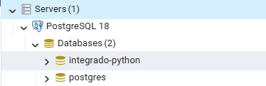
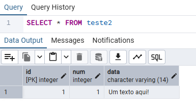

# Integração Python + PostgreSQL 🐘🐍

Exemplo de como conectar um script Python a um banco de dados PostgreSQL usando a biblioteca [psycopg 3](https://www.psycopg.org/psycopg3/).

---

## 📦 Como iniciar o projeto

**Pré-requisitos:** Python 3.14+, [uv](https://docs.astral.sh/uv/) e um PostgreSQL instalado (com o pgAdmin para visualizar os dados).

**1. Instale as dependências.** O comando cria a pasta `.venv` e instala o `psycopg` declarado no `pyproject.toml`:

```bash
uv sync
```

**2. Crie o banco de dados.** No pgAdmin, clique com o botão direito em **Databases** → **Create** → **Database...** e informe o nome `integrado-python`:



**3. Execute o script:**

```bash
uv run main.py
```

Na primeira execução a tabela ainda está vazia, então a lista impressa pelo `SELECT` vem vazia:

```text
[]
Hello from post-py-integration!
```

Executando de novo, o `SELECT` já mostra a linha inserida:

```text
[(1, 1, 'Um texto aqui!')]
Hello from post-py-integration!
```

---

## 🔌 O que colocar na string de conexão

A conexão é montada no formato `chave=valor`, com os pares separados por espaço:

```python
"dbname=integrado-python user=postgres password=postgres"
```

| Chave | O que é | Padrão |
| --- | --- | --- |
| `dbname` | Nome do banco de dados | igual ao `user` |
| `user` | Usuário do PostgreSQL | usuário do sistema |
| `password` | Senha do usuário | — (obrigatória) |
| `host` | Endereço do servidor | `localhost` |
| `port` | Porta do servidor | `5432` |

`host` e `port` podem ser omitidos quando o banco está na sua máquina. Para deixar tudo explícito, use:

```python
"host=localhost port=5432 dbname=integrado-python user=postgres password=postgres"
```

> ⚠️ Deixar a senha escrita no código funciona para estudo, mas em projetos reais o ideal é lê-la de uma variável de ambiente.

---

## 🐍 O que o `main.py` faz

```python
import psycopg

# dbaname vai receber o nome do banco de dados, user vai receber o nome do usuário, password vai receber a senha do usuário
with psycopg.connect("dbname=integrado-python user=postgres password=postgres") as conn:
     with conn.cursor() as cur:

        # Execute a command: this creates a new table
        cur.execute("""
            CREATE TABLE IF NOT EXISTS teste2 (
                id serial PRIMARY KEY,
                num INT,
                data VARCHAR(14)
            )
        """)

        cur.execute("SELECT * FROM teste2")
        dados_teste2 = cur.fetchall()
        print(dados_teste2)

        if len(dados_teste2) == 0:
            cur.execute("""
                INSERT INTO teste2 (num, data) VALUES (%s, %s)
                """, (1, "Um texto aqui!"))


def main():
    print("Hello from post-py-integration!")


if __name__ == "__main__":
    main()
```

Passo a passo:

1. **`psycopg.connect(...)`** — abre a conexão com o PostgreSQL usando a string de conexão. Se o banco não existir ou a senha estiver errada, o erro aparece aqui (`psycopg.OperationalError`).
2. **`with ... as conn:`** — gerencia a conexão. Ao sair do bloco, o psycopg faz o **commit** (salva as mudanças) se tudo deu certo, ou **rollback** se houve exceção.
3. **`with conn.cursor() as cur:`** — cria o cursor, que é o objeto usado para enviar os comandos SQL, e garante que ele seja fechado no final.
4. **`CREATE TABLE IF NOT EXISTS teste2 (...)`** — cria a tabela `teste2` caso ela ainda não exista. As colunas são: `id` (chave primária preenchida automaticamente pelo banco), `num` (número inteiro) e `data` (texto de até 14 caracteres).
5. **`SELECT * FROM teste2` + `cur.fetchall()`** — lê todas as linhas já gravadas na tabela. Veja [Como receber dados](#-como-receber-dados).
6. **`print(dados_teste2)`** — mostra as linhas lidas (uma lista, vazia na primeira execução).
7. **`if len(dados_teste2) == 0:` + `INSERT ...`** — só insere a linha de exemplo se a tabela estiver vazia, evitando duplicar registros a cada execução. Veja [Como fazer INSERT com variáveis](#-como-fazer-insert-com-variáveis).
8. **`def main()` / `if __name__ == "__main__":`** — vem do template do `uv`, apenas imprime uma saudação e **não** tem relação com o banco.
9. O bloco de conexão está fora de `main()`, então ele roda **assim que o script é executado**.

---

## ✍️ Como fazer INSERT com variáveis

Em vez de escrever os valores dentro do SQL, use os marcadores `%s` e passe os valores como segundo argumento do `execute`:

```python
cur.execute(
    "INSERT INTO teste2 (num, data) VALUES (%s, %s)",
    (1, "Um texto aqui!"),
)
```

- `%s` é o marcador de **todos** os tipos (`int`, `float`, texto, `None`...) — não use `%d` nem `%f`.
- Os valores vão em uma tupla (ou lista) **na mesma ordem** dos marcadores. Aqui, o primeiro `%s` recebe `1` e o segundo recebe `"Um texto aqui!"`.
- Tupla com um único valor precisa da vírgula no final: `(42,)`.
- Para gravar `NULL`, passe `None` como valor.

**Por que não concatenar?** Montar o SQL com f-string abre espaço para **SQL Injection** e ainda quebra o comando por causa de aspas ou acentos. Com parâmetros, o SQL e os valores chegam separados ao servidor e o driver faz o escape:

```python
# ❌ NÃO faça isso
cur.execute(f"INSERT INTO teste2 (num, data) VALUES (1, '{valor}')")

# ✅ Certo
cur.execute("INSERT INTO teste2 (num, data) VALUES (%s, %s)", (1, valor))
```

Outras variações úteis:

```python
# Vários registros de uma vez
cur.executemany(
    "INSERT INTO teste2 (num, data) VALUES (%s, %s)",
    [(2, "Segunda linha"), (3, "Terceira linha")],
)

# Parâmetros com nome (mais legível quando há muitos campos)
cur.execute(
    "INSERT INTO teste2 (num, data) VALUES (%(num)s, %(data)s)",
    {"num": 4, "data": "Quarta linha"},
)

# Recuperando o id gerado automaticamente pelo banco
cur.execute(
    "INSERT INTO teste2 (num, data) VALUES (%s, %s) RETURNING id",
    (5, "Quinta linha"),
)
print(cur.fetchone()[0])
```

> ⚠️ A coluna `data` é `VARCHAR(14)`: aceita no máximo 14 caracteres — e `"Um texto aqui!"` tem exatamente 14. Textos maiores geram o erro `value too long for type character varying(14)`; nesse caso, mude a coluna para `VARCHAR(50)` ou `TEXT`.

---

## 📖 Como receber dados

Depois de executar um `SELECT`, o cursor guarda o resultado. Use `fetchall()` para pegar todas as linhas ou `fetchone()` para pegar uma só:

```python
cur.execute("SELECT id, num, data FROM teste2 ORDER BY id")

for id_, num, data in cur.fetchall():
    print(f"id={id_} num={num} data={data}")
```

- `fetchall()` retorna uma **lista de tuplas** — é por isso que o `print` do `main.py` mostra algo como `[(1, 1, 'Um texto aqui!')]`.
- `fetchone()` retorna a próxima linha ou `None` quando não há mais resultados.
- Como `fetchall()` carrega tudo na memória, em tabelas grandes é melhor iterar o próprio cursor:

```python
cur.execute("SELECT id, num, data FROM teste2")
for linha in cur:
    print(linha)
```

Para acessar as colunas pelo nome em vez da posição, use `dict_row`:

```python
from psycopg.rows import dict_row

with psycopg.connect(conn_str, row_factory=dict_row) as conn:
    with conn.cursor() as cur:
        cur.execute("SELECT id, num, data FROM teste2")
        for linha in cur.fetchall():
            print(linha["data"])
```

---

## ✅ Conferindo no pgAdmin

Navegue até `integrado-python` → **Schemas** → `public` → **Tables** → `teste2`, clique com o botão direito e escolha **View/Edit Data** → **All Rows** (ou rode `SELECT * FROM teste2` no **Query Tool**):



| Coluna | Tipo | Observação |
| --- | --- | --- |
| `id` | `[PK] integer` | Preenchida automaticamente pelo banco |
| `num` | `integer` | Recebeu o valor `1` |
| `data` | `character varying (14)` | Recebeu o texto `"Um texto aqui!"` |

---

## 📚 Referências

- [psycopg 3 — Documentação oficial](https://www.psycopg.org/psycopg3/docs/)
- [psycopg 3 — Uso básico](https://www.psycopg.org/psycopg3/docs/basic/usage.html)
- [uv — Gerenciador de projetos Python](https://docs.astral.sh/uv/)
- [PostgreSQL — Documentação](https://www.postgresql.org/docs/)
